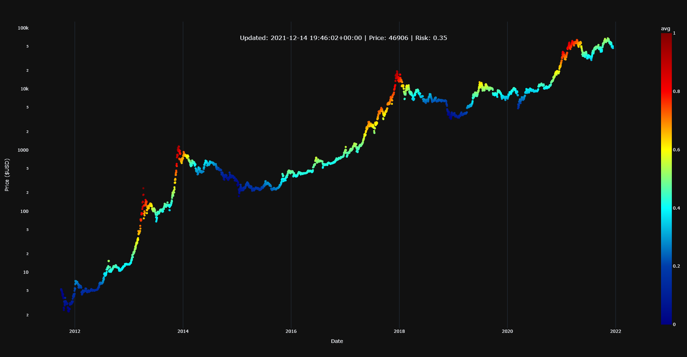
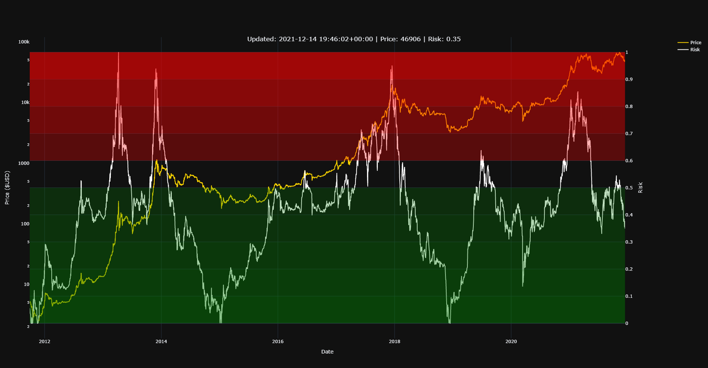

# Bitcoin Risk Metric




## About the Project

This code is for Bitcoin (*BTC*) `risk metric`, the whole purpose of it is to help you DCA ([Dollar-Cost Averaging](https://www.investopedia.com/terms/d/dollarcostaveraging.asp)) your investment according to Bitcoin risk. Watch my YouTube videos ([link](https://www.youtube.com/channel/UCrlkqSLmHL8ZPVpOxj7La4Q)) to understand this metric's workings better.

## Installation

Tested for **Python 3.10.0+**

```bash
$ git clone https://github.com/BitcoinRaven/Bitcoin-Risk-Metric-V2.git
$ cd Bitcoin-Risk-Metric-V2
$ pip install -r requirements.txt
```

## Usage

```bash
$ python BtcRiskMetricV2.py
```

## Contact

- [Telegram Group](https://t.me/BitcoinRaven)
- [Youtube channel](https://www.youtube.com/channel/UCrlkqSLmHL8ZPVpOxj7La4Q)
- [Ready to run code](https://colab.research.google.com/drive/1DejFMbwO7S7Dd7aV4z7FuGBu9VtTOcSv?usp=sharing) (Just hit play on the left)
- [Risk Metric Website](https://risk.bitstack.se/) Thanks to [0xsark](https://twitter.com/0xsark)
- [TradingView Indicator](https://www.tradingview.com/script/K5YcHwKk-BTC-Risk-Metric/) Thanks to [Skywalking2874](https://www.tradingview.com/u/Skywalking2874/)
